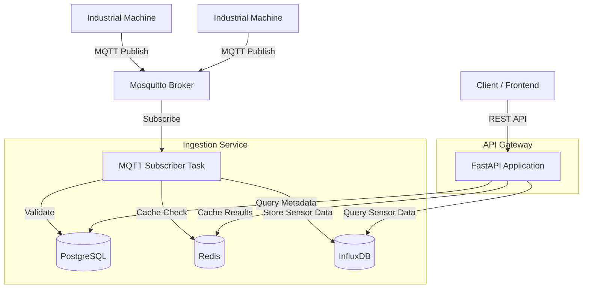

# Real-Time Machine Data Ingestion Service

This project implements a high-performance microservice designed for receiving, storing, and serving real-time sensor data from industrial machines. It leverages FastAPI for the web layer, MQTT for real-time data ingestion, InfluxDB for time-series storage, PostgreSQL for metadata management, and Redis for caching.

## Key Features

- **Real-Time Ingestion**: Asynchronous MQTT subscriber for high-throughput sensor data.
- **Hybrid Storage Strategy**: PostgreSQL for structured metadata and InfluxDB for optimized time-series data.
- **Distributed Caching**: Redis integration for fast metadata retrieval and reduced database load.
- **Role-Based Access Control (RBAC)**: Secure API endpoints with multi-role authentication.
- **Structured Logging**: JSON-formatted logs with rotation and level-based persistence.
- **Containerized Architecture**: Fully Dockerized environment for consistent deployment.
- **Robust Validation**: Extensive Pydantic-based data validation and custom exception handling.

## Technology Stack

- **Framework**: FastAPI (Python 3.11+)
- **Database (Metadata)**: PostgreSQL 15 (SQLAlchemy/Alembic)
- **Database (Time-Series)**: InfluxDB 2.7
- **Caching**: Redis 7
- **Message Broker**: Mosquitto (MQTT)
- **Logging**: Python logging with custom JSON formatter
- **Testing**: Pytest with coverage reporting

## System Architecture

The following diagram illustrates the high-level data flow and component interaction:



## Getting Started

### Prerequisites

- Python 3.11 or higher
- Docker and Docker Compose
- Virtualenv (recommended)

### Local Configuration

1. Clone the repository.
2. Create a `.env` file from the example:

   ```bash
   cp .env.example .env
   ```

3. Update the credentials in `.env` to match your local environment.

### Running with Docker

The easiest way to start the entire stack is using Docker Compose:

```bash
docker-compose up -d --build
```

This will spin up:

- **API Service**: Accessible at `http://localhost:8000`
- **PostgreSQL**: Port `5432`
- **InfluxDB**: Port `8086` (UI available at `http://localhost:8086`)
- **Redis**: Port `6379`
- **Mosquitto**: Port `1883`

## API Documentation

Once the service is running, you can access the interactive API documentation at:

- **Swagger UI**: [http://localhost:8000/docs](http://localhost:8000/docs)
- **ReDoc**: [http://localhost:8000/redoc](http://localhost:8000/redoc)

Authentication is required for most endpoints. Use the `scripts/generate_mock_data.py` to populate the database and obtain a test token.

## Development and Testing

### Setup Environment

```bash
python -m venv venv
source venv/bin/activate
pip install -r requirements.txt -r requirements-dev.txt
```

### Running Tests

Execute the test suite using `pytest`:

```bash
pytest
```

To view coverage reports:

```bash
pytest --cov=app tests/
```

### Generating Mock Data

A utility script is provided to simulate machines and ingest data:

```bash
python scripts/generate_mock_data.py
```

## Assessment Documentation

For detailed technical explanations, design decisions, and assessment answers, refer to:

- [ASSESSMENT_ANSWERS.md](ASSESSMENT_ANSWERS.md)

## License

This project is licensed under the Apache License 2.0. See the [LICENSE](LICENSE) file for details.
